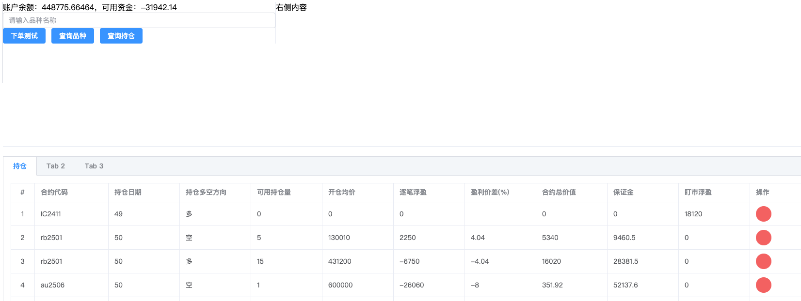
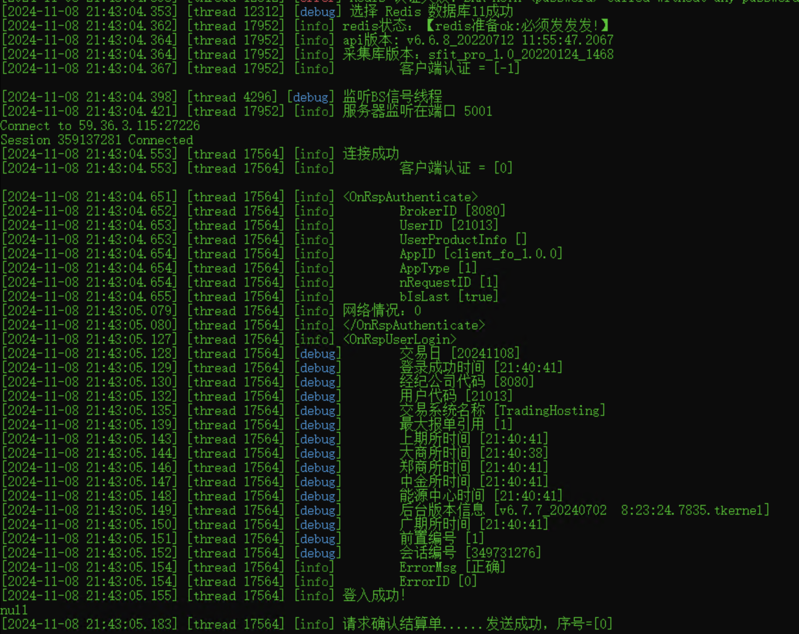
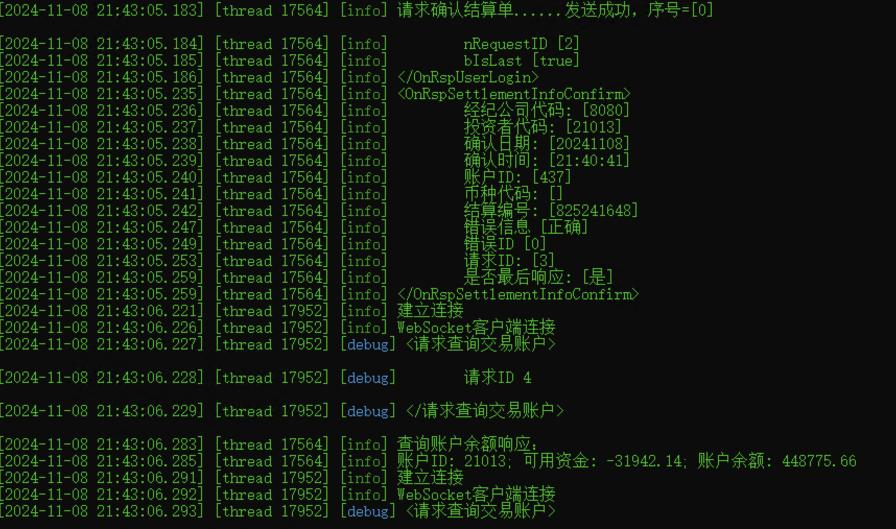

> 本项目是基于上期所的api的websocket和redis消息队列的封装，方便期货自动交易，量化交易
>
> 
>
> <font color="red">本项目使用上期所提供的c++接口二次封装，提供websocket和redis消息桥接，方便不想使用c++的js或者python选手也能调用自动下单的一些相关命令</font>
>
> 在本项目提供了两种方式和ctp交互：
>
> 1.使用websocket的js调用方式
>
> 2.直接python、js或者其他语言把消息推到redis里，本程序会自动消费消息，并做相应的处理


#### 1.安装依赖、编译

```shell
set VCPKG_DEFAULT_TRIPLET=x64-windows
vcpkg install uwebsockets:x64-windows
vcpkg install cpp-redis:x64-windows
```


```shell
#相关依赖的版本：
yaml-cpp:x64-windows                              0.8.0#1
uwebsockets:x64-windows                           20.67.0
nlohmann-json:x64-windows                         3.11.3#1
fmt:x64-windows                                   11.0.2#1
cpp-redis:x64-windows                             4.3.1#5
```


#### 2.配置账号

根目录下有config.yaml和 dev.yaml、simnow.yaml

config.yaml里直接配置需要使用的环境的配置文件即可，例如想使用开发环境的配置dev.yaml，则配置config.yaml里的根节点为dev
```yaml
profile: dev
```

dev.yaml的配置目前分为两类：账号类，系统配置类：redis和websocket配置。请注意自己要使用，请换成自己的账号和授权码

```yaml
account:
  FrontAddr: "tcp://59.36.3.115:27226"
  FrontMdAddr: "tcp://59.36.3.115:27236"
  BrokerID: "8080"
  UserID: "21013"
  Password: "zwy123321"
  InvestorID: "21013"
  UserProductInfo: "test"
  AuthCode: "0000000000000000"
  AppID: "client_fo_1.0.0"
  InstrumentID: "sr2505"
  ExchangeID: "CZCE"
  bIsUsingUdp: 1
  bIsMulticast: 0
sys:
  #redis信息
  REDIS_HOST: "192.168.1.214"
  REDIS_DB: 11
  REDIS_PORT: 8379
  REDIS_POOL_SIZE: 3
  REDIS_RECONNECT_TIMES: 16
  REDIS_INTERVAL_SECONDES: 10
  #websocket 端口
  WEBSOCKET_PORT: 5001
  #ws心跳秒数
  HEART_INTERVAL: 3
  #日志级别，参见
  #define SPDLOG_LEVEL_TRACE 0
  #define SPDLOG_LEVEL_DEBUG 1
  #define SPDLOG_LEVEL_INFO 2
  #define SPDLOG_LEVEL_WARN 3
  #define SPDLOG_LEVEL_ERROR 4
  #define SPDLOG_LEVEL_CRITICAL 5
  #define SPDLOG_LEVEL_OFF 6
  LOG_LEVEL: 1
```


#### 3.运行

先启动客户端：双击exe，在启动js前端

js前端调用代码：

```js

    const connect = () => {
      const reconnectInterval = 5000; // 重连间隔时间，单位为毫秒
      // 尝试连接WebSocket服务器
        socket.value = new WebSocket(localStorage.getItem("ctpWsUrl"));
        socket.value.onopen = (event) => {
          console.log('WebSocket连接已打开:', event);
        };

        socket.value.onmessage = (event) => {
          if(event.data=="无相"){
            if (socket.value && socket.value.readyState === WebSocket.OPEN) {
              console.log('心跳收到：',event.data);
              socket.value.send("无我");
            }
          }
          else{
            const data = JSON.parse(event.data);
            console.log('收到服务器消息:', data);
            if(data.success){
              // 检查消息类型是否为qryTradingAccount
              if (data.type === 'qryTradingAccount') {
                          balance.value = data.data.balance; // 更新账户余额
                          available.value = data.data.available; // 更新可用资金
                        }
              // 持仓
              if (data.type === 'qryInvestorPosition') {
                positions.value = data.data;
              }
            }
          }
        
          
          
        };

        socket.value.onclose = (event) => {
          console.log('WebSocket连接已关闭:', event);
          // 当连接关闭时，尝试重新连接
          setTimeout(connect, reconnectInterval);
        };

        socket.value.onerror = (error) => {
          console.error('WebSocket发生错误:', error);
          // 发生错误时，关闭连接并尝试重新连接
          if (socket.value) {
            socket.value.close();
          }
        };
      };


    
    // 发送消息到服务器
    const sendMessage = (message) => {
      console.log(socket.value);
      console.log(socket.value.readyState);
      if (socket.value && socket.value.readyState === WebSocket.OPEN) {
        socket.value.send(JSON.stringify(message));
      } else {
        // connect();
        console.error('WebSocket连接尚未打开。');
      }
    };
    // 查询持仓的方法
    const qryInvestorPosition = () => {
      const currentTime = new Date().toISOString();
      const message = {
        type: "qryInvestorPosition",
        time: currentTime
      };

      sendMessage(message);
    };

```


#### 4.待办清单

- [x] 账号信息使用配置文件灵活切换

- [x] 自动登入，并且确认结算单

- [x] 查询持仓

- [x] 下单【含开平】（市价单、限价单）

- [x] websocket连接，长连接，心跳检测

- [ ] 撤单

  

#### 5.运行截图

##### 前端：


后端：



